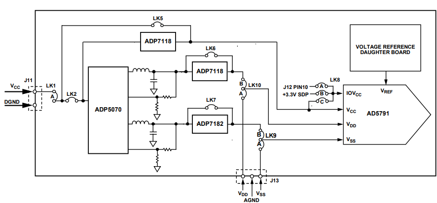

# Laser Lock Box Project
_Software and documentation developed by Alexander Nazeeri&Zhaozhong Cao (alexandernazeeri@ucsb.edu&zhaozhongcao@umail.ucsb.edu)_  
_Hardware made by Hongrui Yan(hongrui_yan@ucsb.edu_  


This repository contains all the software that is needed to operate the laser lock box based on TEENSY 4.1. In this document a complete overview is given of how to use the software and how the backend software is structured.

<div style="border: 5px solid red; padding: 5px;">
    <span style="color: red;"><b>NOTE:</b></span> This setup involves a CW laser operating at 976nm. Though working at invisible band, please still be careful with your eyes.
</div>
<br>

This code is developed in Arduino IDE and in the language of C++. The code is summarized into three parts: 1) Use ADC to read the error signal, 2) Apply PID to the error signal, 3) Use DAC to output the control signal


## How to setup the software
One has to realize that this software is not a complete, one click compiled program. I recommend to run and compile on the TEENSYduino, Version 1.59. This is an add-on to the Arduino IDE and the detailed installation can be found at https://www.pjrc.com/teensy/td_download.html


<details>  
  <summary><b>Step 1: clone repo</b></summary>

In order to run the code on a new computer, first clone the GitHub repository. If you do not have git installed, please download it here: https://git-scm.com/downloads 
</details>

<br>

<details>  
  <summary><b>Step 2: setup the environment</b></summary>
    under construction


</details>
<br>
<details>  
  <summary><b>Step 3: run program</b></summary>

Under Construction

</details>

<div style="page-break-after: always;"></div>

## Break Down 

Code will be explained here

### DAC 


<details>
  <summary><b>Hardware Selection</b></summary>

To achieve a good cavity locking, we require a precise output of the control signal.  We are using the evaluation EVAL-AD5791SDZ as the external DAC module. The central chip is AD5791, a powerful chip performing 1 ppm, 20-Bit, ±1 LSB INL, Voltage Output DAC.
<br>
The communication between the EVAL-AD5791SDZ and TEENSY 4.1 is through SPI Mode_1. 

</details>

<br>

<details>
  <summary><b>Step 1: Setup the power supply connection</b></summary>

  <div style="border: 5px solid red; padding: 5px;">
    <span style="color: red;"><b>WARNING:</b></span> Please, do not, do not, do not use your computer USB to power this board! Please use an external voltage supply to drive it. 
</div>
<br>
The evaluation board offers three ways for power supply: 1)ADP 5070 with LDOS 2) ADP 5070 3) Bench Supply. In order to select the way of power supply, there are multiple physical switches on the board that must be inserted or removed. Since I am using ADP 5070 with LDOs, I will put my connection here: 
<br>

</details>

<br>

<details>
<summary><b>Step 3: set starting position</b></summary>

In this dialog you set the starting position of stages for the pulling process. The 'start Δx' is the distance between the two clamping points. The 'go to start vel' defines how fast the horizontal stages are moved to the starting position. The 'heater up vel' defines how fast the vertical stage moves up. The starting position of axis 3 is always at 25 mm, which is the maximum in the range of the stage. 

After the 'Go to start' button is clicked, all three stages move to their respective positions. After this, the fiber can be placed in the clamps. If necessary the clamps with the rails can be taken out the place the fiber. 

 <div style="border: 5px solid red; padding: 5px;">
    <span style="color: red;"><b>WARNING:</b></span> Before moving the stages to their starting positions, make sure to untighten the fiber clamp that is not held by the spring from the rails, such that both stages can move freely. Make sure that the vertical stage is also free to move and will not collide with any other parts of the setup. 
</div>

</details>

<br>

<details>
  <summary><b>Step 4: set voltages heater</b></summary>

The AC voltage over the ceramic heater element has to incremented very slowly to not damage the heater and maintain temperature reproducability over long use time. One sets a starting voltage, a final voltage and a voltage slope. Every second, the voltage is incremented by the voltage slope until the final voltage is reached. One can also set the frequency of the AC supply signal for the heater. When the 'Turn on heater' button is clicked the output of the power supply will be turned on and the heater will slowly heat up. 

<div style="border: 5px solid red; padding: 5px;">
    <span style="color: red;"><b>WARNING:</b></span> Once the heater is warmed up, do not touch the heater itself or any of the metal close to heater as it can reach dangerously high temperatures.
</div>

<br>

</details>

<br>
<details>
  <summary><b>Step 5: pulling proces</b></summary>

The most important step in the process is the actual pulling of the fiber. In order to do this, three step have to be taken. First, the heater has to be lowered over the fiber.
<div style="border: 5px solid red; padding: 5px;">
    <span style="color: red;"><b>WARNING:</b></span> Before lowering the heater, first make sure that the heater is aligned properly with the fiber by moving it with the two manual translation stages, in order to prevent the heater from damaging the fiber, or even worse, collide with any other part of the setup. 
</div>

<br>

The heater is lowered to the position set by 'heater pos' with a velocity set by 'heater lowering vel'. This velocity can be important if you want the fiber to heat up slowly. By making use of the temperature gradient in the insertion slit of the heating element one can slowly increase the temperature around the fiber. The heater is lowered by pressing the 'Lower heater' button. 

<div style="border: 5px solid red; padding: 5px;">
    <span style="color: red;"><b>WARNING:</b></span> The 'heater' pos had to be carefully set to prevent the heater from damaging the fiber. Make sure to first calibrate this value before moving the stage. 
</div>

<br>

Next, the settings for the actual pulling of the fiber are set. With 'final Δx' one sets the final distance between the two clamps. One can also opt to instead set 'pull distance' _d<sub>pull</sub>_, which is the distance one single stage is moving during the pulling process. The total increase in length of the fiber _Δx<sub>tot</sub>_ is therefore

<p style="text-align: center;"><i>Δx<sub>tot</sub> = Δx<sub>final</sub> - Δx<sub>start</sub> = 2d<sub>pull</sub></i> .</p>


The 'pulling vel' sets the velocity with which the fiber is pulled per stage. The total velocity at which the fiber increases in length is thus twice the velocity per stage. Clicking the button 'Pull Fiber' initiates the pulling of the fiber. 

 <div style="border: 5px solid red; padding: 5px;">
    <span style="color: red;"><b>WARNING:</b></span> Before moving the stages to pull the fiber, make sure to untighten the fiber clamp that is not held by the spring from the rails, such that both stages can move freely.
</div>

<br>

Finally one defines the speed at which the heater moves back up with 'heater back vel'. The heater always moves back to its highest position at 25 mm. Similarly to the lowering of the heater, this velocity has to be carefully set to slowly cool down and prevent breakage of the fiber due to thermal shock. 

As these three steps do not require any human intervention, the software has the option to perform all three steps consequtively with a set waiting time between each step. These can be set in the input fields between the button for the individual steps. The button 'Run all' starts the three processes. 

After the pulling is completed, one can tighten the clamps to the rails and take out the fiber clamp holder. One can now use the spring mechanism to tension the fiber: untighten the clamp that is held by the spring from the rails, and pull back the actuator to get the fiber under the tension of the spring. Monitoring the transmission of the fiber during tensioning can be useful. 
</details>

<br>

<details>
  <summary><b>Step 6: heater cool down</b></summary>

The final step is the cooling down of the heater. It is recommended to first move the heater away from the fiber with the manual stages. This way the fiber is not exposed to any remaining heat, and can be taken off from the stages for further steps. For the cool down, only the 'cool down slope' has to be set: the voltage over the heater is decremented every second by the value of the slope untill a voltage of 0 V is reached, after which the output of the power supply is turned off. 

</details>
<div style="page-break-after: always;"></div>
### Default values and saving settings

Upon start up, all input fields are already filled in with default values. These values are stored in an XML-file `defaults.xml`. This file also stores the range in which the variable can be set. This ensures that no unsafe values can be set. 

<details>
  <summary><b>Changing default values</b></summary>

It can be useful to store values for the input fields so that certain settings can be retrieved to reproduce a tapered fiber. In order to do this, one can adapt the `defaults.xml` file and set specific default values. If needed, the ranges of the input fields can also be changed. 
<div style="border: 5px solid red; padding: 5px;">
    <span style="color: red;"><b>WARNING:</b></span> Be careful with changing the range on the input fields or setting default values; it may lead to unsafe values that cause damage to the setup.
</div>
<br>
One does not have to modify the code the use a different defaults file. One can simply use the `-defaults` argument when calling the script:

```powershell
python FiberTaperSetupSoftware.py -defaults \path\to\custom_defaults.xml
```

When this argument is not given, it will use `.\GUI\defaults.xml`. 

</details>

<div style="page-break-after: always;"></div>

## Code Structure

The folders and files of the software are structured as follows:

```
Software-Fiber-Taper-Setup\
├───gui\
│   ├───__init__py
│   ├───defaults.xml
│   ├───fiber_taper_UI.py
│   ├───icon.ico
│   ├───MainWindow.ui
├───interfaces\
│   ├───__init__py
│   ├───axis_controller.py
│   ├───interface.py
│   ├───motion_controller_interface.py
│   ├───power_supply_interface.py
├───miscellaneous\
│   ├───amp_to_temp.py
│   ├───screenshot_fiber_taper_software.png
│   ├───taper_pulling.vi
├───.gitignore
├───FiberTaperSetupSoftware.py
├───readme.md
├───requirements.txt
```

The file `FiberTaperSetupSoftware.py` is the main file, and is executed when running the software for regular use, as described above. The software is mainly divided into two folders: `gui\` contains all files related to the visual and interactive part of the UI, while `interfaces\` containes the backend that is used to communicate with the motion controller and power supply. Finally, there is a folder `miscellaneous\` that contains some other files that are not directly used for running the software. 

Below the contents of these three folders is discussed. Note that this is a brief description of what each files does, and some short example of how to use it. For more information on how the code works, attributes, methods and variables, the source code is well documented and provided with ample comments. 

<details>
<summary><b>interfaces</b></summary>

- `interface.py` contains the `Interface` class, which is a general class for communicating with any instrument. In has attributes that store import variables for communication, such as baudrate and termination characters. It also contains the instrument identifier, based on which it is able to connect to the proper device. The method `get_instrument()` is done by attempting to make a connection with all available connected devices, querying the device's ID and matching it with the initialized ID. If there is a match, the algorithm stops and returns a PyVisa `SerialInstrument` object. 

- `motion_controller_interface.py` contains the `MotionControllerInterface` class, which is a subclass of the `Interface` class. This class uses a PyVisa `SerialInstrument` object to communicate with the motion controller with ASCII-commands. The `get_instrument()` is called directly upon initialization. It contains methods that are not axis-specific, such as homing all axes, turn all axes on or off, performing simultaneous motion, monitoring motion and retrieving errors from the motion controller. This class contains three `AxisController` objects from the file `axis_controller.py`. This class contains methods that only apply to one axis, such as setting its position, velocity, homing or stopping the axis. Each axis has a variable `axis_nr` that correspondes with the labels on the motion controller. It also contains an `update()` method, which retrieves all useful quantities from the motion controller and stores them. One can then retrieves these attributes. 

  For instance, one can set the velocity of one specific axis and monitor the motion as follows: 
  ```python
  from motion_controller_interface import MotionControllerInterface
  import time

  # initialize instrument
  instrument = MotionControllerInterface()

  # it is best practice to start every programm with homing all axes
  instrument.home_all_axes()

  # turn on and set position and velocity
  instrument.ax2.turn_on()
  instrument.ax2.set_vel(0.2) # in mm/s
  instrument.ax2.set_pos(10) # in mm

  # monitor the motion by updating (retrieves all useful information from the mc)
  # and printing its position every second
  while instrument.ax2.is_moving:
    #get useful quantities
    print(instrument.ax2.get_pos())
    print(instrument.ax2.get_pos())

    #which is the same as
    instrument.update()
    print(instrument.ax2.pos)
    print(instrument.ax2.vel)

    time.sleep(1)

  # always turn off the axis when the motion is done. 
  instrument.ax1.turn_off()
  ```

- `power_supply_interface.py` contains the `PowerSupplyInterface` class, which is again a subclass of the `Interface` class. It contains methods to set the voltage of the power supply and read out the voltage, current or power. It also contains a method to retrieve the errors from the device. Similar to the `MotionControllerInterface`, the class has an `update()` method that retrieves all useful quantities from the power supply and stores them in attributes. It is important to note that the interface is only developed to set and read AC-voltage, while the ASR-2100 can in also deliver DC-voltages. 
<div style="page-break-after: always;"></div>
  Here a short example of how you can set the voltage and the read out its current and power:

  ```python
  from power_supply_interface import PowerSupplyInterface
  import time

  # initialize instrument
  instrument = PowerSupplyInterface()

  # set voltage
  instrument.set_voltage(10) # in V

  # read out useful quantities
  print(instrument.get_current_rms()) # in Arms
  print(instrument.get_power()) # in W

  # which outputs the same as 
  instrument.update()
  print(instrument.current_rms)
  print(instrument.power)
  ```

Please inspect the source code to see what other methods and attributes are available. 

</details>
<br>

<details>
  <summary><b>gui</b></summary>

- `fiber_taper_UI.py` contains the `FiberTaperUI` class. This is a subclass of the `QMainWindow` class from the PyQt6 package. This class is the main window of the UI; it will launch the main window with the `Qmainwindow.show()` method. It will also load an icon saved as `icon.ico`, which is a schematic picture of a tapered fiber. The `FiberTaperUI` class contains methods that initialize the application such as loading the whole visual layout, setting default values and ranges for the input fields, performing monitoring of both devices and using the interfaces to execute processes when buttons in the UI are clicked. Most methods of this class are never accessed in code, only through interaction in the UI, and I will therefore not go into too much detail on this. Below a short example of how to launch the application in code:

  ```python
  from fiber_taper_UI import FiberTaperUI
  from PyQt6.QtWidgets import QApplication

  app = QApplication(sys.argv)
  main_window = FiberTaperUI()
  main_window.show()
  app.exec()
  ```

- `MainWindow.ui` is a `.xml`-file that stores the whole visual layout of the setup. It is generated by the interactive UI design tool 'QtDesigner'. This program allows you to drag and drop widgets into the main window, define the layout, add text, etc. After saving the `.xml`-file is generated which is loaded into the `FiberTaperUI` class using the function `PyQt6.uic.LoadUi()`. Now all widgets in the UI are attributes of the `FiberTaperUI` class. 

- `defaults.xml` is a second `.xml`-file that stores the default values, ranges, units and descriptions of all input fields, as well as the descriptions for the buttons. This `defaults.xml` is separate from the `MainWindow.ui` with the idea that `defaults.xml` can be easily changed, without having to go into QtDesigner. Especially the default values can be used to store certain settings to reproduce a tapered fiber, for instance a tapered fiber with a desired thickness. The descriptions are used to generated tooltips when hovering over input fiels or buttons. These can also be changed for different settings, to inform a user with specifics on this setting. How to use the program with a different defaults-file can be read in the section above. 
  
</details>
<br>

<details>
  <summary><b>miscellaneous</b></summary>

- `amp_to_temp.py` is a simple script that fits a fourth degree polynomial to the calibration curve of the ceramic heating element. The fitted parameters are not loaded from this file, but simple hard coded into the `get_temp()` method of the `FiberTaperUI` class, as this fitting procedure has only been done once. In order to fitting the pixel coordinates of the data points where determined by hand. 

- `taper_pulling.vi` is the labview code that is used for the fiber tapering setup at the University of California in Santa Barbara, on which the setup in Leiden is based. This file can be consulted to retrieve what values for the velocities and voltages they are using. 

- `screenshot_fiber_taper_software.png` is screenshot of the software that is included in the `readme.md`. 
</details>
