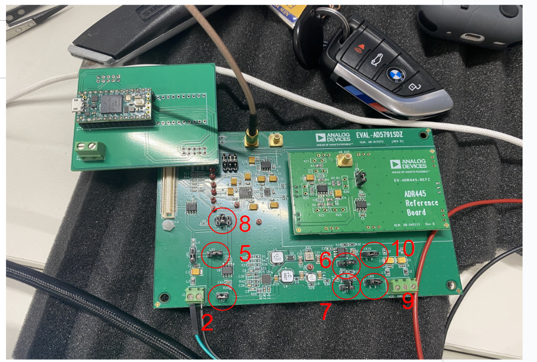
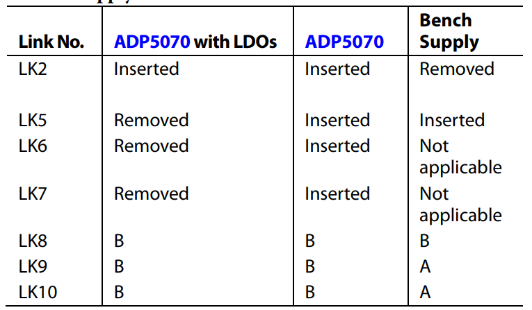
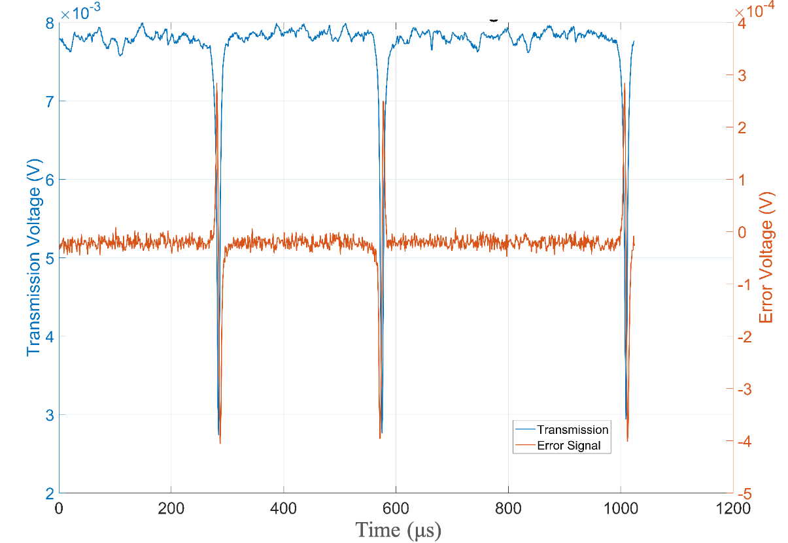
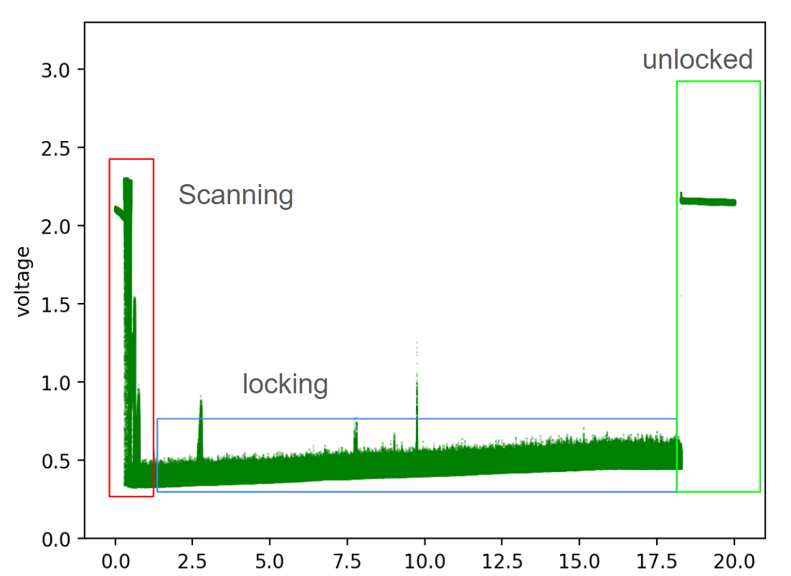
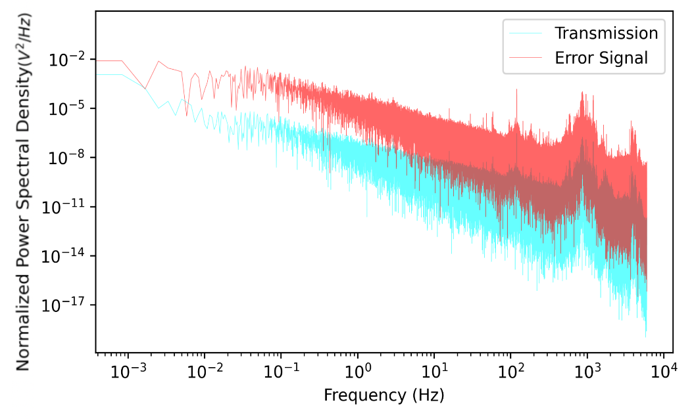
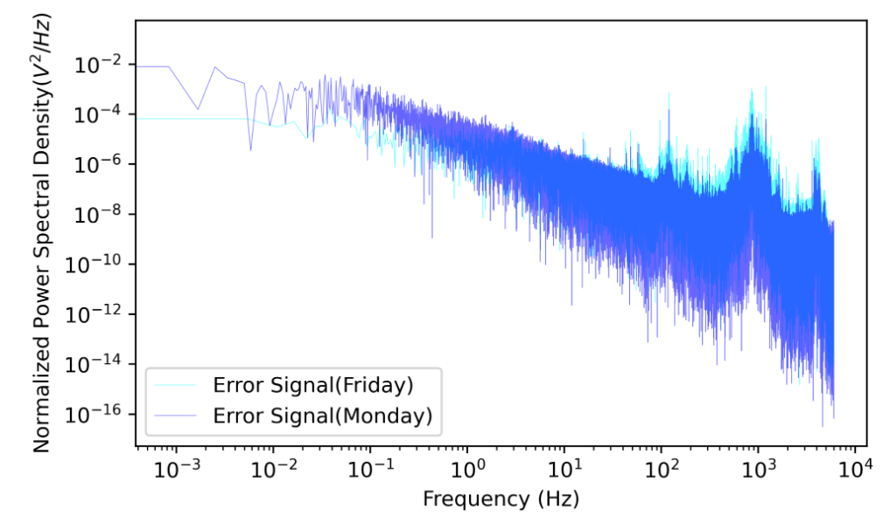
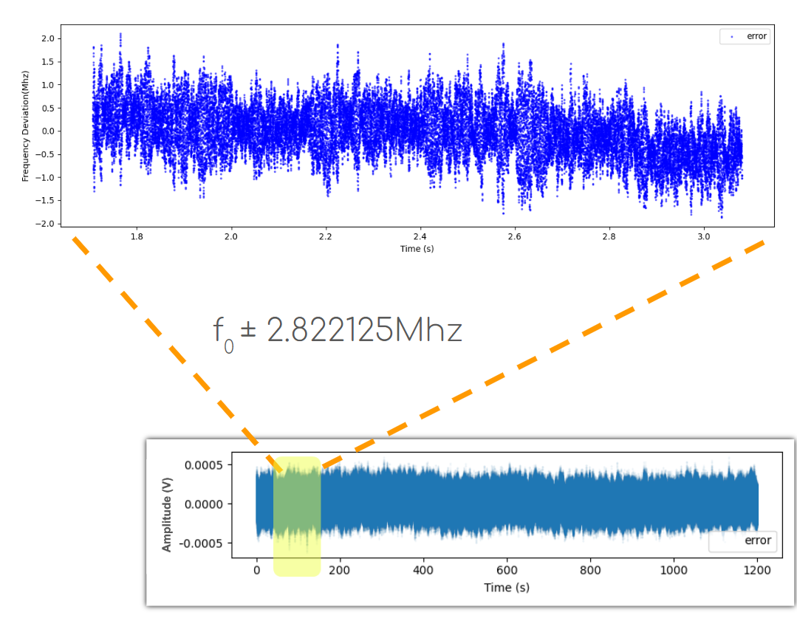
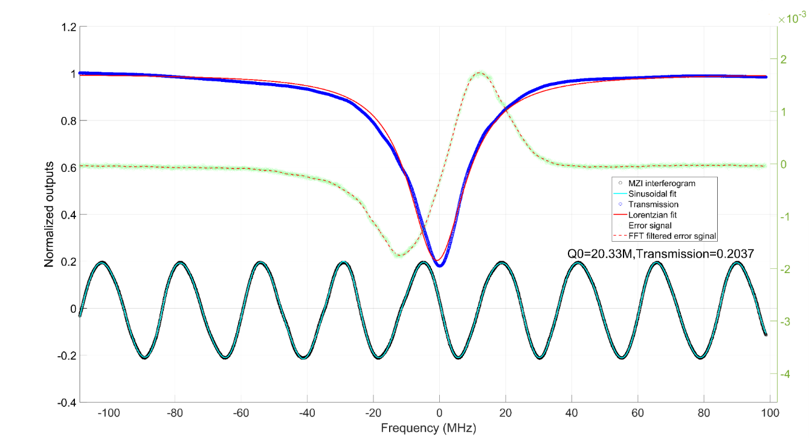

# Laser Lock Box Project
_Software and documentation developed by Alexander Nazeeri&Zhaozhong Cao (alexandernazeeri@ucsb.edu&zhaozhongcao@umail.ucsb.edu)_  
_Hardware made by Hongrui Yan(hongrui_yan@ucsb.edu_  

This repository contains all the software that is needed to operate the laser lock box based on TEENSY 4.1. In this document a complete overview is given of how to use the software and how the backend software is structured.

    <b>NOTE:</b> This setup involves a CW laser operating at 976nm. Though working at invisible band, please still be careful with your eyes.

 

This code is developed in Arduino IDE and in the language of C++. The code is summarized into three parts: 1) Use ADC to read the error signal, 2) Apply PID to the error signal, 3) Use DAC to output the control signal

## How to setup the software
One has to realize that this software is not a complete, one click compiled program. I recommend to run and compile on the TEENSYduino, Version 1.59. This is an add-on to the Arduino IDE and the detailed installation can be found at https://www.pjrc.com/teensy/td_download.html

  
<b>Step 1: clone repo</b>

In order to run the code on a new computer, first clone the GitHub repository. If you do not have git installed, please download it here: https://git-scm.com/downloads 

 

 
  
<b>Step 2: setup the environment</b>

    Simply uploading the laser_locking_v1.ino to TEENSY through the TEENSYDUINO. You have to manually press the button on top of TEENSY to succussfully reboot the program.

 

  
<b>Step 3: run program</b>

  I have wrote the command sets for TEENSY and you could use any serial port communication software to send the instruction. Refer to the Instruction Set section for the code.

## Break Down 

Code will be explained here

### DAC 

  
<b>Hardware Selection</b>

To achieve a good cavity locking, we require a precise output of the control signal.  We are using the evaluation EVAL-AD5791SDZ as the external DAC module. The central chip is AD5791, a powerful chip performing 1 ppm, 20-Bit, ±1 LSB INL, Voltage Output DAC.
 
The communication between the EVAL-AD5791SDZ and TEENSY 4.1 is through SPI Mode_1. 

 

  
<b>Step 1: Setup the power supply connection</b>

  

    <b>WARNING:</b> Please, do not, do not, do not use your computer USB to power this board! Please use an external voltage supply to drive it. 

 
The evaluation board offers three ways for power supply: 1)ADP 5070 with LDOS 2) ADP 5070 3) Bench Supply. In order to select the way of power supply, there are multiple physical switches on the board that must be inserted or removed. Since I am using ADP 5070 with LDOs, I will put my connection here: 
 

 

<b>Step 2: Important Pins before communication</b>

    
- CLR: Active when it is LOW. This will set the output of the DAC to a default value. This pin must be set to HIGH to avoid constantly clearing the output.
- RESET: Active when it is LOW. This will reset the DAC back to the power-on state. This pin must be set to HIGH to avoid constantly reseting.
- SDIN: Serial Data Input. Connect it to MOSI for SPI.
- SYNC: Don't be confused by the name. It serves as the function of CS. This must be set to LOW for the DAC board to start communication and set to HIGH when the communication is over. At HIGH, the DAC board will refuse to communicate through SPI.
- SCLK: Clock for SPI
- SDO: Serial Data Output. Connect it to MISO for SPI.
- LDAC: Active when it is LOW. When you write to the DAC register, the previous value will not be erased. Only when the LDAC is active, the old value will be erased and the new-written value starts to become the true output. To perform a real time update, LDAC must be set to LOW.

 

  
<b>Step 3: Setup the Control Register</b>

Below is a summary of the 24-bit register settings for the DAC:

| Bit(s) | Name       | Description                                                     | Setting | Function                                                      |
|--------|------------|-----------------------------------------------------------------|---------|---------------------------------------------------------------|
| 23      | RBUF       | Output amplifier configuration control.                         | 0       | Internal amplifier powered up.                                |
|        |            |                                                                 | 1       | Internal amplifier powered down (default).                    |
| 22 | OPGND      | Output ground clamp control.                                    | 0       | DAC output clamp to ground removed, DAC in normal mode.       |
|        |            |                                                                 | 1       | DAC output clamped to ground, DAC in tristate mode (default). |
| 21    | DACTRI     | DAC tristate control.                                           | 0       | DAC in normal operating mode.                                 |
|        |            |                                                                 | 1       | DAC in tristate mode. Tri state means that the output can exists in three different states:high.low, and high impedance  (default).                               |
| 20      | BIN/2sC    | DAC register coding selection.                                  | 0       | Uses twos complement coding (default).                        |
|        |            |                                                                 | 1       | Uses offset binary coding.                                    |
| 19      | SDODIS     | SDO pin enable/disable control.                                 | 0       | SDO pin enabled (default).                                    |
|        |            |                                                                 | 1       | SDO pin disabled (tristate).                                  |
| 15 to 18| LIN COMP   | Linearity error compensation for varying reference input spans. | 0000    | Reference input span up to 10 V (default).                    |
|        |            |                                                                 | 1001    | Reference input span between 10 V and 12 V.                   |
|        |            |                                                                 | 1010    | Reference input span between 12 V and 16 V.                   |
|        |            |                                                                 | 1011    | Reference input span between 16 V and 19 V.                   |
|        |            |                                                                 | 1100    | Reference input span between 19 V and 20 V.                   |
| 1     | R/overline{W} | Read/write select bit.                                       | 0       | Addressed for a write operation.                              |
|        |            |     |1 | Addressed for a read operation |        
|2 to 4 | Select which register to talk to| |001 | DAC|
| || |010 | Control register|
|Other bits||||They are useless and must be set to 0|

 

 

  
<b>Step 4: Setup the DAC Register</b>

  
The transfer function for this board is:

  $$
  V_{out}(x) = \frac{VrefP-VrefN}{2^{20} - 1} \cdot x + VrefN = \frac{10+10}{2^{20} - 1} \cdot x + 10
  $$

  
The DAC register configuration is straightforward:

  - **bit 1**: Write or read.
  - **bits 2 to 4**: Select which register to communicate with.
  - **bits 5 to 24**: These 20 bits are the binary number for \( x \).

## Code Structure

  
<b>Overview</b>

Performing cavity locking on a DSP board suffers from a variety of limitations. The most crucial one is handling multiple tasks simultaneously. In short, cavity locking can be summarized as:
1. Scan
2. Read error signal
3. Apply PID on error signal
4. Output the control signal

This is achieved by using multiple interrupts:

### CPU Timer 1
- **Function**: Triggers an interrupt regularly every 10 µs.
- **Purpose**: Used for scanning to produce a triangular wave. The frequency of the triangular wave is tuned by the clock frequency, and the amplitude is adjusted by changing the voltage level written to the DAC board.

### ADC ISR Interrupt
- **Function**: Triggers an interrupt when the ADC sampling is ready.
- **Purpose**: Used to correct the control signal and also serves as a long-term measurement of the voltage variation during locking.

### Serial Interrupt
- **Function**: Mimics the effect of a physical interrupt.
- **Purpose**: During locking, the user typically needs to communicate with the Teensy to set parameters such as the set point, PID coefficients, and commands to start/stop locking and scanning. A custom instruction set is sent through serial port communication with the Teensy.

### CPU Timer 2
- **Function**: Triggers an interrupt regularly every 1000 µs (1 ms), tunable down to 1 µs.
- **Purpose**: Handles the PID control. Within this ISR, it stores the current error for integration and outputs the control signal.

### CPU Timer 3(under construction)
- **Fuction**: This interrupt is for tunning the PID during the locking process
-**Purpose**: When locking to different peaks, a different set of PID parameters is needed. However, there is not way to theoretically calculate the prcise value for PID before you experiment it. Right now user have to relaunch the TEENSY to update the PID coefficients but for effectively tunning, it is good to have another interrupt to handle this. 

  
<b>Instruction Set</b>

  Current instruction sets are compatible with: 

  Toggle:x; where x is 1 or 0. This can turns on/off a triangular wave

  Set:x; where x is a voltage level and for safety reason, if the user enters a value with abs(x)>0, this will force the voltage to set back to 0V. 

  PID:P,I,D; this command will tell the TEENSY to begin locking to: Kp*e + Kd*de/dt+Ki*int e(t) dt. Notice that if you do not previously set a level, this will use 0 as a setpoint. In most of the cases, the setpoint depends on the voltage level of your peak, and they are not zero. To find the voltage level of the setpoint, Johnson has wrote a python script that takes a screenshot of the oscilloscope with channel 1 as the transmission signal and the channel 2 as the scanning triangular wave. 

# Pound Drever Hall
Pound Drrever Hall aims to generate an **antisymmetric** signal around the resonance. This is achieved by modulating your electric field signal. Some useful math identities that we will use to derive this techniques are: 

---
Given the equation:

$$
    E_0 e^{iwt} \rightarrow E_0 e^{i (w t + \beta \sin{(\Omega t)})}
$$

where $\beta$ and $\Omega$ are the amplitude and frequency of the sine wave generated by the function generator. Using the Jacobi-Anger expansion [1], when the modulation depth is weak enough, we have:

$$
     E_0 e^{i (w t + \beta \sin{(\Omega t))}} 
    \approx E_0 e^{iwt} (1+J_1(\beta) e^{i \Omega t}-J_1(\beta) e^{-i \Omega t})
$$

where $J_1$ is the first-order Bessel function.

---

The product-to-sum identities are useful for converting products of sine and cosine functions into sums or differences. Here are the key formulas:

1. **Product of Sine and Cosine:**

$$
   \cos(A) \sin(B) = \frac{1}{2} [\sin(A + B) - \sin(A - B)]
$$

2. **Product of Two Cosines:**

$$
   \cos(A) \cos(B) = \frac{1}{2} [\cos(A + B) + \cos(A - B)]
$$

3. **Product of Two Sines:**

$$
   \sin(A) \sin(B) = \frac{1}{2} [\cos(A - B) - \cos(A + B)]
$$

when A=B, we could effectively understand them as decouple your signal from a product into a DC signal and a high frequency signal, which we could later use a low pass filter to get the DC signal, or we could use the high pass filter to get the high frequency signal. The core is that you split your signal into two separte signals with distinct frequency. 

---
The reflected field is given by:

$$
    E_{\text{ref}}(t) = E_0 \left[ r(\omega_0) J_0(\beta) e^{i \omega_0 t} + r(\omega_0 + \Omega) J_1(\beta) e^{i (\omega_0 + \Omega) t} - r(\omega_0 - \Omega) J_1(\beta) e^{i (\omega_0 - \Omega) t} \right]
$$

The photodetector measures the intensity of the reflected field. The signal is:

$$
I_{\text{ref}}(t) = |E_{\text{ref}}(t)|^2
$$

We are interested in the component of $I_{\text{ref}}(t)$ at the modulation frequency $\Omega$. This component can be extracted using a mixer and a low-pass filter. The demodulated signal is proportional to:

$$
\begin{equation}
\begin{split}
    P_{\text{out}} &=|\hat{F}\ket{input}|^2\\ 
    &=P_c |F(\omega)|^2 + P_s \left\{ |F(\omega + \beta)|^2 + |F(\omega - \beta)|^2 \right\} +\\
     2 \sqrt{P_c P_s}& \text{Re} \left\{ \boxed{ F(\omega) F^*(\omega + \beta) 
    - F^*(\omega) F(\omega - \beta)} \right\} \cos \beta t + \\
    &\text{Im} \left\{ \boxed{F(\omega) F^*(\omega + \beta)  
    - F^*(\omega) F(\omega - \beta) }\right\}\sin\beta t + \\
    &(\text{2}\beta \text{ terms}).
\end{split}
\end{equation}
$$

The thing in the boxed is the error signal. There is a reason that I do not expand them. Here is the expansion result, replace F by the transfer function 

$$
F(\omega) = \frac{E_{\text{ref}}}{E_{\text{inc}}} = \frac{r\left(\exp\left(\frac{i\omega}{\Delta\nu_{\text{fsr}}}\right) - 1\right)}{1 - r^2\exp\left(\frac{i\omega}{\Delta\nu_{\text{fsr}}}\right)},
$$

---

The error signal is: 

$$
    \frac{4 r^2 \cos\left(\frac{\text{modulation}}{2 \, \text{fsr}}\right) \sin\left(\frac{\text{modulation} - \omega}{2 \, \text{fsr}}\right) \sin\left(\frac{\omega}{2 \, \text{fsr}}\right)}{\left(-1 + r^2 \cos\left(\frac{\text{modulation} - \omega}{\text{fsr}}\right) - i r^2 \sin\left(\frac{\text{modulation} - \omega}{\text{fsr}}\right)\right) \left(-1 + r^2 \cos\left(\frac{\omega}{\text{fsr}}\right) - i r^2 \sin\left(\frac{\omega}{\text{fsr}}\right)\right)} 
$$

$$
    - \frac{4 i r^2 \sin\left(\frac{\text{modulation}}{2 \, \text{fsr}}\right) \sin\left(\frac{\text{modulation} - \omega}{2 \, \text{fsr}}\right) \sin\left(\frac{\omega}{2 \, \text{fsr}}\right)}{\left(-1 + r^2 \cos\left(\frac{\text{modulation} - \omega}{\text{fsr}}\right) - i r^2 \sin\left(\frac{\text{modulation} - \omega}{\text{fsr}}\right)\right) \left(-1 + r^2 \cos\left(\frac{\omega}{\text{fsr}}\right) - i r^2 \sin\left(\frac{\omega}{\text{fsr}}\right)\right)} 
$$

$$
    + \frac{r^2}{\left(-1 + r^2 \cos\left(\frac{\omega}{\text{fsr}}\right) + i r^2 \sin\left(\frac{\omega}{\text{fsr}}\right)\right) \left(-1 + r^2 \cos\left(\frac{\text{modulation} + \omega}{\text{fsr}}\right) - i r^2 \sin\left(\frac{\text{modulation} + \omega}{\text{fsr}}\right)\right)} 
$$

$$
    - \frac{r^2 \cos\left(\frac{\omega}{\text{fsr}}\right)}{\left(-1 + r^2 \cos\left(\frac{\omega}{\text{fsr}}\right) + i r^2 \sin\left(\frac{\omega}{\text{fsr}}\right)\right) \left(-1 + r^2 \cos\left(\frac{\text{modulation} + \omega}{\text{fsr}}\right) - i r^2 \sin\left(\frac{\text{modulation} + \omega}{\text{fsr}}\right)\right)} 
$$

$$
    - \frac{r^2 \cos\left(\frac{\text{modulation} + \omega}{\text{fsr}}\right)}{\left(-1 + r^2 \cos\left(\frac{\omega}{\text{fsr}}\right) + i r^2 \sin\left(\frac{\omega}{\text{fsr}}\right)\right) \left(-1 + r^2 \cos\left(\frac{\text{modulation} + \omega}{\text{fsr}}\right) - i r^2 \sin\left(\frac{\text{modulation} + \omega}{\text{fsr}}\right)\right)} 
$$

$$
    + \frac{r^2 \cos\left(\frac{\omega}{\text{fsr}}\right) \cos\left(\frac{\text{modulation} + \omega}{\text{fsr}}\right)}{\left(-1 + r^2 \cos\left(\frac{\omega}{\text{fsr}}\right) + i r^2 \sin\left(\frac{\omega}{\text{fsr}}\right)\right) \left(-1 + r^2 \cos\left(\frac{\text{modulation} + \omega}{\text{fsr}}\right) - i r^2 \sin\left(\frac{\text{modulation} + \omega}{\text{fsr}}\right)\right)} 
$$

$$
    - \frac{i r^2 \sin\left(\frac{\omega}{\text{fsr}}\right)}{\left(-1 + r^2 \cos\left(\frac{\omega}{\text{fsr}}\right) + i r^2 \sin\left(\frac{\omega}{\text{fsr}}\right)\right) \left(-1 + r^2 \cos\left(\frac{\text{modulation} + \omega}{\text{fsr}}\right) - i r^2 \sin\left(\frac{\text{modulation} + \omega}{\text{fsr}}\right)\right)} 
$$

$$
    + \frac{i r^2 \cos\left(\frac{\text{modulation} + \omega}{\text{fsr}}\right) \sin\left(\frac{\omega}{\text{fsr}}\right)}{\left(-1 + r^2 \cos\left(\frac{\omega}{\text{fsr}}\right) + i r^2 \sin\left(\frac{\omega}{\text{fsr}}\right)\right) \left(-1 + r^2 \cos\left(\frac{\text{modulation} + \omega}{\text{fsr}}\right) - i r^2 \sin\left(\frac{\text{modulation} + \omega}{\text{fsr}}\right)\right)} 
$$

$$
    + \frac{i r^2 \sin\left(\frac{\text{modulation} + \omega}{\text{fsr}}\right)}{\left(-1 + r^2 \cos\left(\frac{\omega}{\text{fsr}}\right) + i r^2 \sin\left(\frac{\omega}{\text{fsr}}\right)\right) \left(-1 + r^2 \cos\left(\frac{\text{modulation} + \omega}{\text{fsr}}\right) - i r^2 \sin\left(\frac{\text{modulation} + \omega}{\text{fsr}}\right)\right)} 
$$

$$
    - \frac{i r^2 \cos\left(\frac{\omega}{\text{fsr}}\right) \sin\left(\frac{\text{modulation} + \omega}{\text{fsr}}\right)}{\left(-1 + r^2 \cos\left(\frac{\omega}{\text{fsr}}\right) + i r^2 \sin\left(\frac{\omega}{\text{fsr}}\right)\right) \left(-1 + r^2 \cos\left(\frac{\text{modulation} + \omega}{\text{fsr}}\right) - i r^2 \sin\left(\frac{\text{modulation} + \omega}{\text{fsr}}\right)\right)} 
$$

$$
    + \frac{r^2 \sin\left(\frac{\omega}{\text{fsr}}\right) \sin\left(\frac{\text{modulation} + \omega}{\text{fsr}}\right)}{\left(-1 + r^2 \cos\left(\frac{\omega}{\text{fsr}}\right) + i r^2 \sin\left(\frac{\omega}{\text{fsr}}\right)\right) \left(-1 + r^2 \cos\left(\frac{\text{modulation} + \omega}{\text{fsr}}\right) - i r^2 \sin\left(\frac{\text{modulation} + \omega}{\text{fsr}}\right)\right)}
$$

I swear to god this is antisymmetric because the plot of it, using a 10M hz Resonance EOM to modulate the laser light around 976nm, we have experimentally observed the genration of error signal 

This is the error signal we obtained during the scanning. This is a very good indicator 
1. it is linear around the resoannce
2. its linear range is very large in y direction compared to its neighbour
3. we could use this signal as the error signal, and then apply PID to it to output the control signal. 

Below is the result obtained by 20mins cavity locking: 

To analyze the error, here are the power spectrum density: 

Clearly, there 1k hz noise peak, to confirm if this is a stochastic noise, we run the experiments on the other day: 

The 1k hz noise falls into the acoustic regime and we highly suspect that this is due to the pump oscillation in dirk's lab that drives the vibration of air molecule that hits the fiber. As the polarization of the fiber is sensitive to the mechanical strain inside the fiber, such vibration will cause a change in polarization and it would brings change to the transmission signal that results in this 1khz signal. 

To estimate the drift in frequency, here is the 20mins long measurement of error signal: 

We use the MZI to measure the frequency drift by extracting the phase of it and the frequency difference between peaks, we could use this to estimate the fluctuation in frequency: the maximum frequency drift is $\pm 2.822125Mhz$. Given a peak with 20M hz FWHM roughly, such drift is tolerable and would provide an acceptable locking as proposed in our proposal.

